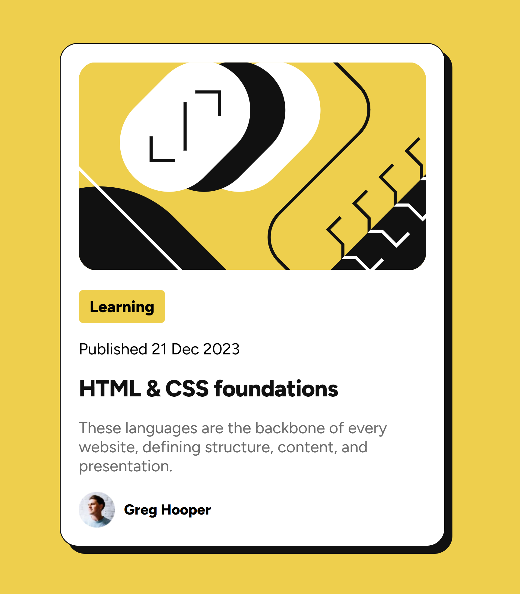

# Frontend Mentor - Blog preview card solution

This is a solution to the [Blog preview card challenge on Frontend Mentor](https://www.frontendmentor.io/challenges/blog-preview-card-ckPaj01IcS).

## Table of contents

- [Overview](#overview)
  - [The challenge](#the-challenge)
  - [Screenshot](#screenshot)
  - [Links](#links)
- [My process](#my-process)
  - [Built with](#built-with)
  - [What I learned](#what-i-learned)
- [Author](#author)

**Note: Delete this note and update the table of contents based on what sections you keep.**

## Overview

### The challenge

Users should be able to:

- See hover and focus states for all interactive elements on the page

### Screenshot

### Links

- Solution URL: [Add solution URL here](https://github.com/yvonnem111/blog-preview-card-main/blob/main/index.html)
- Live Site URL: [Add live site URL here](https://htmlpreview.github.io/?https://github.com/yvonnem111/blog-preview-card-main/blob/main/index.html)

## My process

### Built with

- Semantic HTML5 markup
- CSS custom properties
- Flexbox

### What I learned

Using FlexBox on a body tag needs a height to vertical align a child element.

## Author

- Website - [Yvonne Joseph](https://www.yvonnejoseph.com)
- Frontend Mentor - [@yvonnem111](https://www.frontendmentor.io/profile/yourusername)

